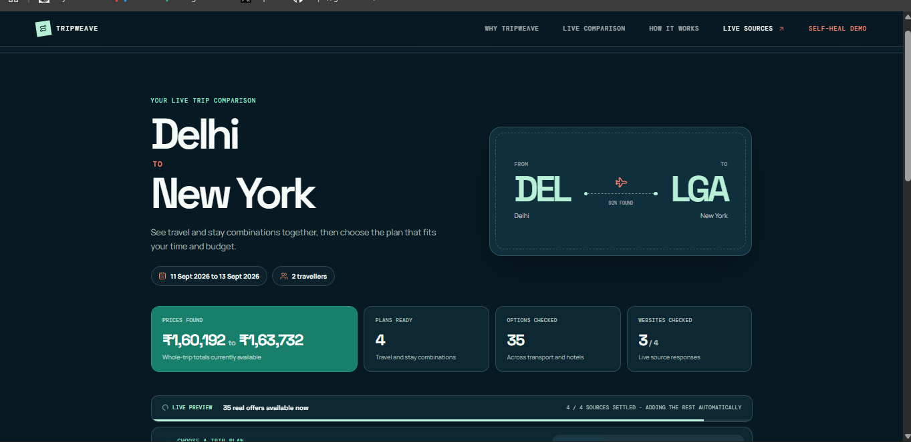
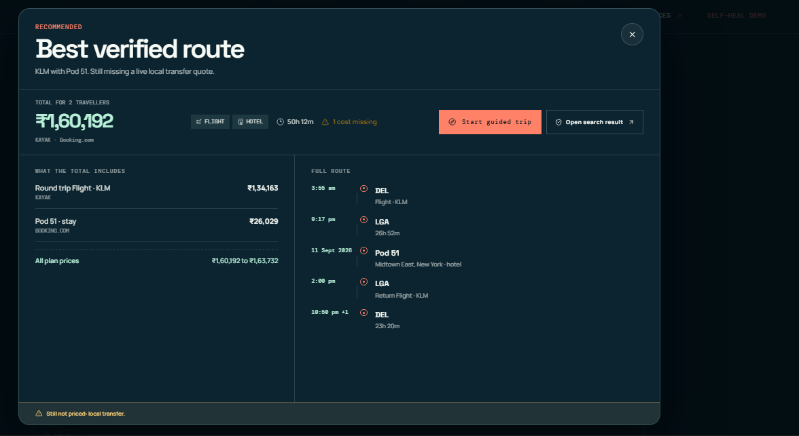
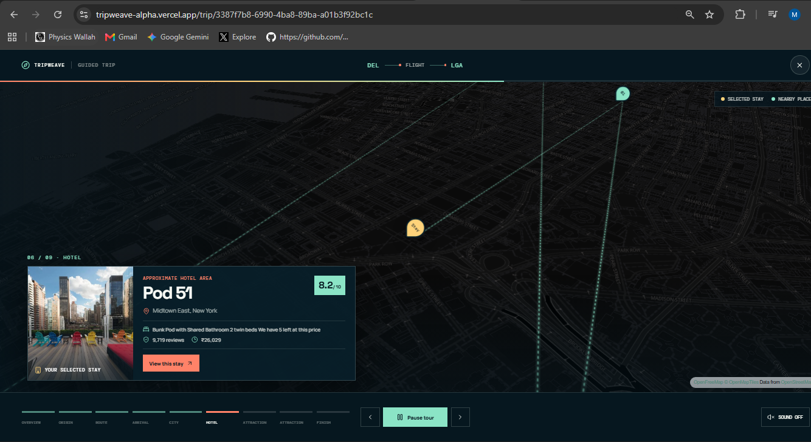
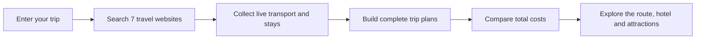
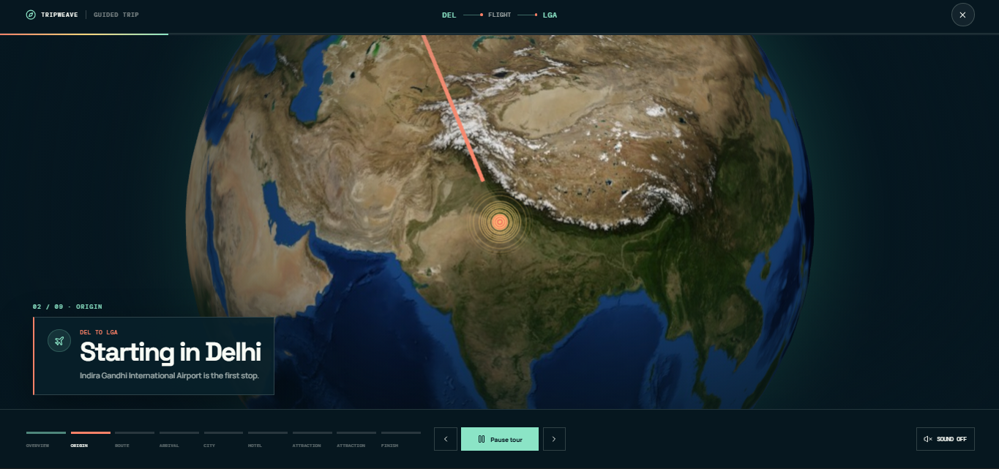

<div align="center">

# TripWeave: Plan the whole trip across the globe

### Transport, stays, nearby attractions and the likely total cost for up to four people in one live search.

Trip planning is fragmented across flight, train, bus and hotel websites, while attractions are researched separately. **TripWeave brings them together as complete, budget-ranked trip plans before you book anything.**

<p>
  <a href="https://tripweave-alpha.vercel.app/"></a>
</p>



**[Try the live app](https://tripweave-alpha.vercel.app/)** · **[Scrape-Verse 2026](https://www.wemakedevs.org/hackathons/scrape-verse)**

</div>

## The problem

There is no simple way to plan a complete trip. Travellers open separate tabs for flights, trains, buses, hotels and things to do. They compare every price manually and often discover too late that the full trip is outside their budget.

## Our solution

Give TripWeave an origin, destination, dates and group size. It searches live public travel listings, starts showing usable results as soon as they arrive, and combines transport with stays into complete plans from the lowest verified total to premium choices.

Each plan includes:

- Travel for up to four people
- A stay for the selected dates
- The combined trip cost
- Timings, stops, hotel rating and location
- Nearby attractions on an interactive route tour
- Direct links back to the websites where each option was found
- A clear warning when a cost, such as a local transfer, is still missing

## See the complete plan

<table>
  <tr>
    <td width="50%"></td>
    <td width="50%"></td>
  </tr>
  <tr>
    <td><strong>One complete total</strong><br />Transport and stay prices are shown together, with every source and missing cost visible.</td>
    <td><strong>From route to destination</strong><br />The guided map reveals the selected hotel and nearby places instead of ending at an airport.</td>
  </tr>
</table>

## How TripWeave works



1. **You describe the trip.** Choose where you are travelling from and to, the dates and one to four travellers.
2. **TripWeave searches seven websites.** Bright Data collects current flight, train, bus and hotel options from the sources that make sense for that route.
3. **Results appear progressively.** TripWeave does not make the traveller wait for every website before showing the first useful plans.
4. **The pieces become complete trips.** Prices from different websites are converted, cleaned and combined into transport-and-stay plans.
5. **You compare the real total.** Plans are ordered from budget to premium, while missing costs remain clearly labelled.
6. **You explore the journey.** The guided experience follows the route across the globe, moves into the destination city, reveals the selected hotel and visits nearby attractions.

## Bright Data is the data layer

Bright Data Scraper Studio powers the live comparison. Booking.com uses Bright Data's prebuilt scraper, while the other six sources use custom Scraper Studio collectors created for TripWeave.

| Website | What TripWeave collects | Scraper used |
|---|---|---|
| [KAYAK](https://www.kayak.com/flights) | Flight prices, airlines, times, duration and stops | Custom Scraper Studio collector |
| [Skyscanner](https://www.skyscanner.net/flights) | Flight alternatives and total prices | Custom Scraper Studio collector |
| [12Go](https://12go.asia/en) | Regional trains, buses and route options | Custom Scraper Studio collector |
| [redBus](https://www.redbus.in/) | Bus operators, timings, availability and prices | Custom Scraper Studio collector |
| [Booking.com](https://www.booking.com/) | Hotels, rooms, ratings and stay prices | Bright Data prebuilt scraper |
| [Expedia](https://www.expedia.com/) | Hotel alternatives, amenities and prices | Custom Scraper Studio collector |
| [Tripadvisor](https://www.tripadvisor.com/) | Extra hotel reference information when requested | Custom Scraper Studio collector |

TripWeave does not blindly run every source for every route. Long international searches skip regional ground transport, Tripadvisor runs only when requested, and recent identical searches are reused to save Bright Data credits.

## Self-healing demo

Websites change, so a scraper that works today can fail tomorrow. TripWeave includes a controlled public hotel website where the judge can see that problem and recovery in one place:

```text
Run the working scraper
        ↓
Change the website structure
        ↓
Run the same scraper and show the failure
        ↓
Let Bright Data propose a repair
        ↓
Judge approves the change
        ↓
Run the same scraper successfully again
```

The target website, returned records, failure, proposed repair and human approval are all visible together in the recovery lab included with TripWeave.

## A trip becomes a story



Opening a guided trip starts at the origin, animates the selected transport route, zooms into the destination and reveals the real selected stay and nearby attractions. Travellers can pause, replay, move between stages or explore manually.

## Example result

This compact **[Delhi to New York example](examples/delhi-new-york.sample.json)** came from a real cached collection:

```json
{
  "route": "Delhi to New York",
  "travellers": 2,
  "plans": 4,
  "liveOptions": 35,
  "totalRange": "₹1,60,192 to ₹1,63,732",
  "selectedPlan": {
    "transport": "KLM round-trip flight",
    "stay": "Pod 51",
    "total": "₹1,60,192",
    "sources": ["KAYAK", "Booking.com"],
    "missing": ["local transfer"]
  }
}
```

Prices are time-sensitive. TripWeave keeps the collection time visible and never invents a value that a source did not return.

## Run locally

### Requirements

- Node.js `22.12.0` or newer
- Bright Data API access
- A Gemini API key for the trip recommendation

```bash
git clone https://github.com/MAYANK-MAHAUR/TripWeave.git
cd TripWeave
npm install
```

Copy `.env.example` to `.env` and add your Bright Data and Gemini credentials. The self-healing variables are only required when running the recovery lab.

```bash
npm run dev
```

Open `http://127.0.0.1:5173`.

### Verify the project

```bash
npm test
npm run build
npm run test:e2e:self-heal
```

The self-healing browser test uses intercepted responses and does not spend Bright Data credits.

## Built with

[Bright Data Scraper Studio](https://brightdata.com/products/web-scraper) · [React](https://react.dev/) · [Vite](https://vite.dev/) · [Express](https://expressjs.com/) · [Gemini](https://ai.google.dev/) · [MapLibre](https://maplibre.org/) · [OpenFreeMap](https://openfreemap.org/) · [OpenStreetMap](https://www.openstreetmap.org/)

Built by **[Mayank Mahaur](https://github.com/MAYANK-MAHAUR)** for **[Into the Scrape-Verse](https://www.wemakedevs.org/hackathons/scrape-verse)**.
